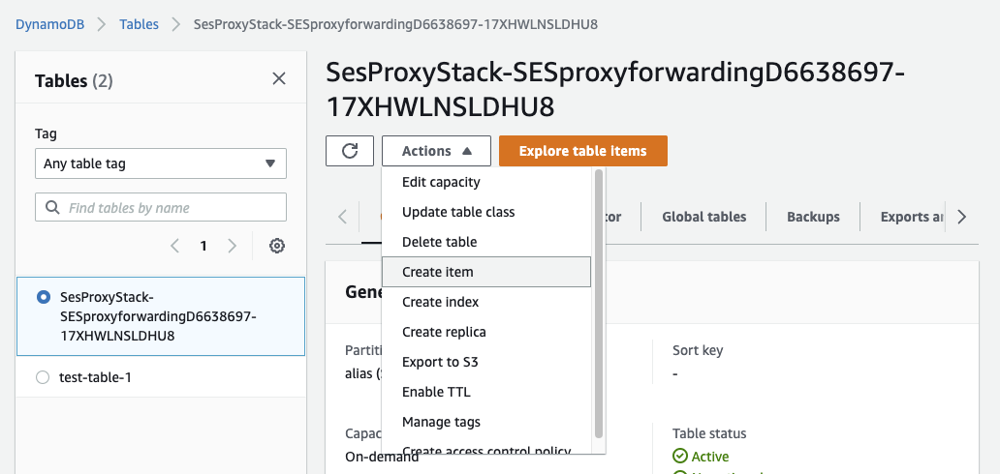
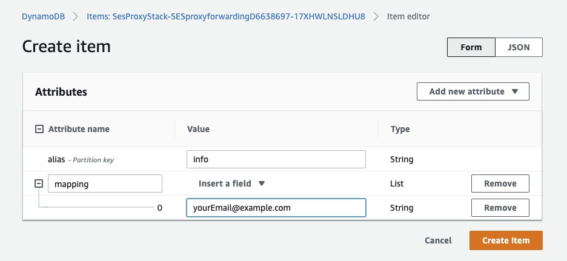
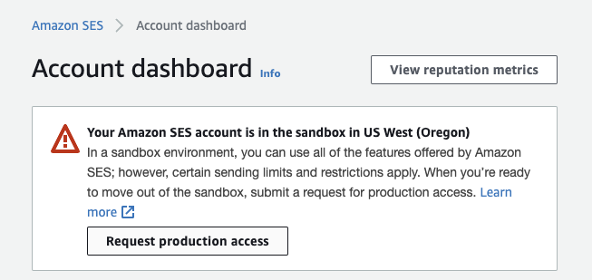

# aws-email-proxy-cdk
Email proxy using AWS services SES, DDB and Lambda. The service can be used to receive emails based off a verified domain in Route53 and send them to a configured list of mappings queried from DDB and sent using SES.

# setup
These are some rough initial stesp for setup. More to come:

1) First, run `aws configure` to configure your aws account with an iam credential pair for your account.

2) from the `./ses-proxy` directory, run `cdk bootstrap`

3) once deployment is complete, open `cdk.json` and edit/verify the following 

``` json
    "s3_bucket_name":"ses-email-proxy", // S3 bucket name where SES stores emails.
    "s3_prefix":"emailsPrefix/", // S3 key name prefix where SES stores email. Include the trailing slash.
    "domain": "example.comn", // Domain to be used for the proxy -- can be set here and committed to repo OR overriden via env variables.
    "from_email":"no-reply@example.com", // Forwarded emails will come from this verified address -- can be set here and committed to repo OR overriden via env variables.
    "subject_prefix": "", // Forwarded emails subject will contain this prefix.
    "allow_plus_sign": "true", // Enables support for plus sign suffixes on email addresses. If set to `true`, the username/mailbox part of an email address is parsed to remove anything after a plus sign. For example, an email sent to `example+test@example.com` would be treated as if it was sent to `example@example.com`.
    "ses_send_endpoint": "inbound-smtp.us-west-2.amazonaws.com" // the SES receiving endpoint used to receive mail. Must be the same as region you deploy to. See https://docs.aws.amazon.com/ses/latest/dg/regions.html for complete list or below table.
```

| Region Name           | Email Receiving Endpoint             |
|-----------------------|--------------------------------------|
| US East (N. Virginia) | inbound-smtp.us-east-1.amazonaws.com |
| US West (Oregon)      | inbound-smtp.us-west-2.amazonaws.com |
| Europe (Ireland)      | inbound-smtp.eu-west-1.amazonaws.com |

4) deploy the stack:

**Option 1:** Pass `DOMAIN_NAME` and `FROM_EMAIL` as environment variables

``` bash
DOMAIN_NAME=<YOUR-DOMAIN> \ 
FROM_EMAIL=<YOUR-USERNAME>@<YOUR-DOMAIN> \
npx cdk deploy
```

**Option 2:** Commit `domain` and `from_email` into `cdk.json`

In this case, deploy with simply:

```
npx cdk deploy
```

5) Configure mappings in DDB

* sign into AWS account
* navigate to DDB
* select table that the cdk stack just created
* select Action -> Create Item



* At the item create screen, for `value`, enter the name of the alias mapping you want to create. For example, to create the alias `info@example.com`, add `info` for the value.

---
**NOTE:**

To match all email addresses on a domain, use a key without the name part of an email address before the "at" symbol (i.e. `@example.com`).

To match a mailbox name on all domains, use a key without the "at" symbol and domain part of an email address (i.e. `info`).

To match all email addresses matching no other mapping, use "@" as a key.

---

* Add mappings by adding a new attribute of type `List`.
* Name the attribute `mapping`.
* Insert a field of type `String`.
* Enter the email address(es) of those who you would like the email received at the above alias sent to. Enter as many fields for as many addresses as needed.



6. Repeat step 5 for as many aliases you would like to add for your domain.

7. Apply for production access in SES by manually filling out the request form from the SES dashboard.



## Credits

Credit for the actual lambda sending logic goes to https://github.com/arithmetric/aws-lambda-ses-forwarder
